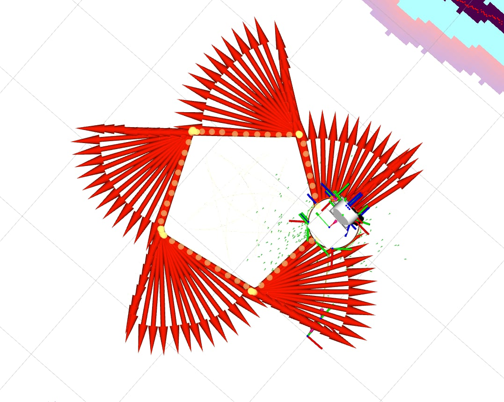
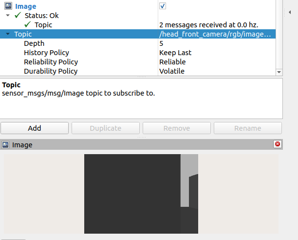
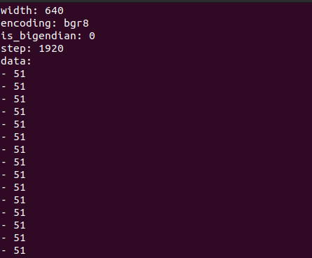

# System poruszania robotem po obwodzie pięciokąta  

## Identyfikacja węzłów i tematów  

Naszym zadaniem było stworzenie systemu, który umożliwi poruszanie robotem po obwodzie pięciokąta. Aby tego dokonać, musieliśmy najpierw zidentyfikować odpowiednie tematy i węzły, na które należy publikować dane sterujące.  

Za pomocą narzędzi **rqt_graph** oraz komendy `ros2 topic echo` zidentyfikowaliśmy:
- Temat **`/cmd_vel_nav`** do zadawania prędkości.  
- Temat **`/mobile_base_controller/odom`** do odczytywania odometrii robota.  

### Przykład publikacji prędkości  
Struktura komendy do zadawania prędkości liniowej i kątowej na węzeł **`/cmd_vel_nav`** z poziomu terminala wygląda następująco:  

```bash
ros2 topic pub /cmd_vel_nav geometry_msgs/msg/Twist "{linear: {x: 0.1, y: 0.0, z: 0.0}, angular: {x: 0.0, y: 0.0, z: 1.0}}"
```

---

## Tworzenie węzła sterującego  

Po zidentyfikowaniu tematów przystąpiliśmy do napisania węzła ROS 2, który będzie publikował odpowiednie wartości prędkości na temat **`/cmd_vel_nav`**.  

W tym celu stworzyliśmy dwie funkcje:  
1. **`send_velocity()`** - do zadawania prędkości liniowej i obrotowej.  
2. **`stop()`** - do zatrzymania robota po zakończeniu ruchu.  

Poniżej znajduje się kod funkcji:

```cpp
void send_velocity(float linear_vel, float radial_vel, auto publisher)
{
    geometry_msgs::msg::Twist cmd_vel;
    cmd_vel.linear.x = linear_vel;
    cmd_vel.angular.z = radial_vel;

    publisher->publish(cmd_vel); 
}

void stop(auto publisher)
{
    geometry_msgs::msg::Twist cmd_vel;
    cmd_vel.linear.x = 0.0;
    cmd_vel.angular.z = 0.0;

    publisher->publish(cmd_vel); 
}
```

---

## Rezultat  

Ostateczny rezultat można zobaczyć na poniższym zdjęciu:  


---

## Identyfikacja sensorów  

Oprócz sterowania prędkością bazy i odczytu odometrii zajęliśmy się także identyfikacją czujników **LIDAR** oraz **kamery RGB-D**.  

### Kamera RGB-D  

Dane z kamery RGB-D są publikowane na temacie **`/head_front_camera/rgb/image_raw`** przez węzeł **`head_front_camera_frame_controller`**.  

#### Efekty wizualne w RViz  
Wynik działania kamery można zobaczyć na poniższym obrazie z RViz:  
  

#### Dane w terminalu  
Odczyt danych z kamery RGB-D za pomocą terminala również przebiegł pomyślnie. Na początku wartości wydawały się nieprawidłowe, ponieważ były identyczne. Jednak po analizie zauważyliśmy, że robot patrzył na ścianę o jednolitym kolorze, co wyjaśniło tę sytuację.  

  

---

### Czujnik LIDAR  

Dane z czujnika LIDAR są publikowane na temacie **`/scan_raw`**. Można je odczytać za pomocą komendy:  

```bash
ros2 topic echo /scan_raw
```

---

## Podsumowanie  

W ramach projektu udało nam się:  
1. Zidentyfikować odpowiednie węzły do sterowania prędkością oraz odczytu odometrii.  
2. Napisać węzeł ROS 2 z funkcjami do sterowania robotem.  
3. Zweryfikować działanie kamery RGB-D oraz czujnika LIDAR.  

Wszystkie cele zostały zrealizowane, a system działa zgodnie z założeniami.