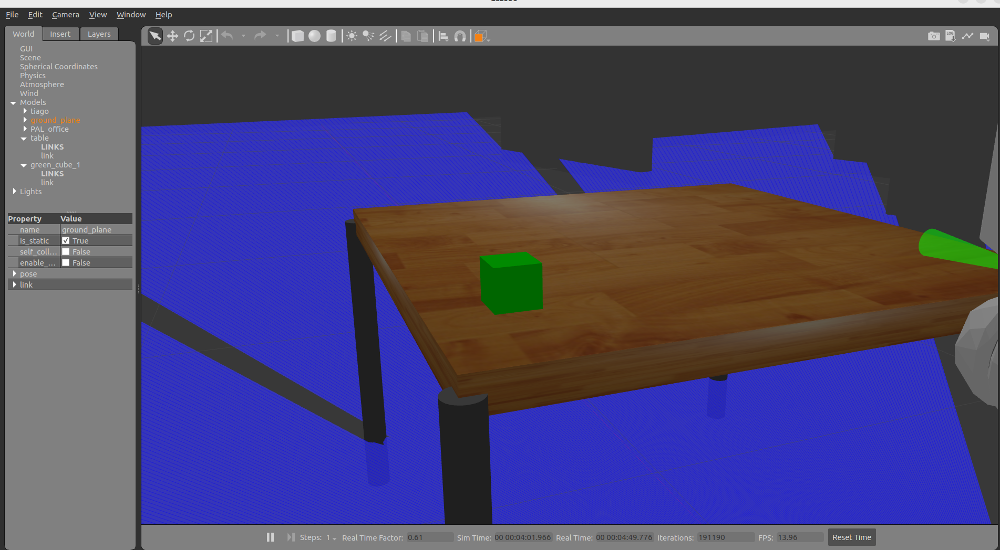

# 1. 
działa
# 2. 
też działa
# 3.
```c++
/gazebo_ros_state
  Subscribers:
  Publishers:
    /link_states: gazebo_msgs/msg/LinkStates
    /model_states: gazebo_msgs/msg/ModelStates
    /rosout: rcl_interfaces/msg/Log
  Service Servers:
    /gazebo_ros_state/describe_parameters: rcl_interfaces/srv/DescribeParameters
    /gazebo_ros_state/get_parameter_types: rcl_interfaces/srv/GetParameterTypes
    /gazebo_ros_state/get_parameters: rcl_interfaces/srv/GetParameters
    /gazebo_ros_state/get_type_description: type_description_interfaces/srv/GetTypeDescription
    /gazebo_ros_state/list_parameters: rcl_interfaces/srv/ListParameters
    /gazebo_ros_state/set_parameters: rcl_interfaces/srv/SetParameters
    /gazebo_ros_state/set_parameters_atomically: rcl_interfaces/srv/SetParametersAtomically
    /get_entity_state: gazebo_msgs/srv/GetEntityState
    /set_entity_state: gazebo_msgs/srv/SetEntityState
  Service Clients:

  Action Servers:

  Action Clients:
```
Za ich pomocą można zdobyć pozycje innych elementów w świecie.

# 4.
Dodaliśmy kostki.


# 5.
B - base_footprint
E - arm_tool_link
F - wrist_ft_link

0,00785;0;0 - pos
0.5;0.5;0.5;0.5 - orient

# 6.
gazebo_msgs.srv.GetEntityState_Response(header=std_msgs.msg.Header(stamp=builtin_interfaces.msg.Time(sec=530, nanosec=173000000), frame_id='tiago::wrist_ft_link'), state=gazebo_msgs.msg.EntityState(name='', pose=geometry_msgs.msg.Pose(position=geometry_msgs.msg.Point(x=-0.00022997992542129943, y=0.002200501457057606, z=0.2418828788634635), orientation=geometry_msgs.msg.Quaternion(x=-0.9998282476773435, y=-0.0007385695267490992, z=-0.017312225996237447, w=0.006573925202053003)), twist=geometry_msgs.msg.Twist(linear=geometry_msgs.msg.Vector3(x=0.003185503303268733, y=0.0029989336688904123, z=-0.024972111221394356), angular=geometry_msgs.msg.Vector3(x=-0.002302170783486864, y=0.00354052310136001, z=0.00026100518439371495)), reference_frame=''), success=True)