# Sprawozdanie z laboratorium drugiego z bloku nawigacji
##  Budowa światów w Gazebo
Stworzyliśmy dwa światy w gazebo: korytarz i mieszkanie. Tak się one prezentują:

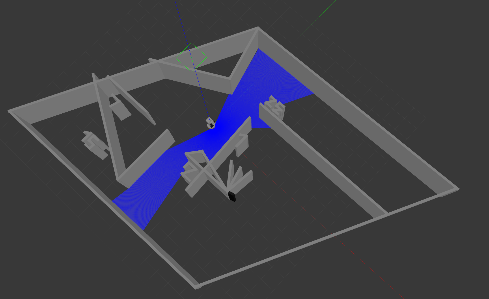 

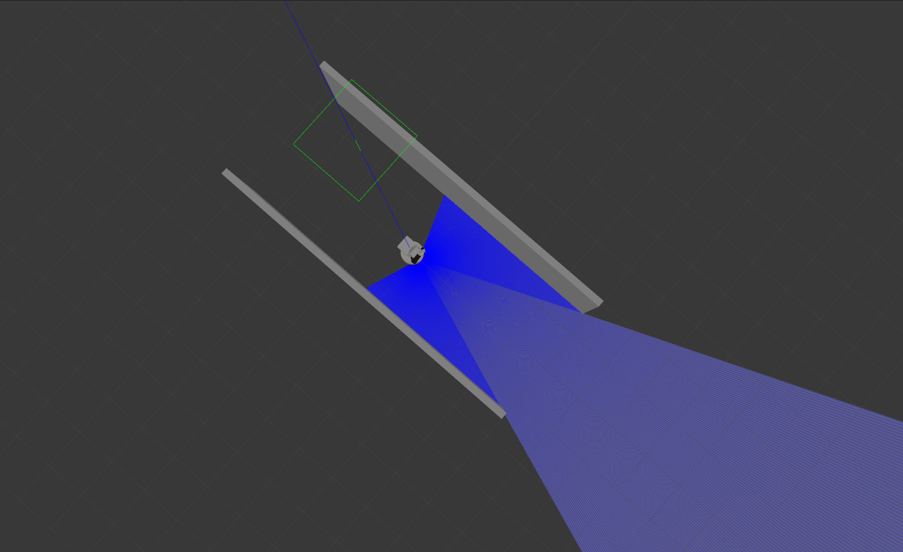 

W mieszkaniu specjalnie stworzono osobne pomieszczenia i wąskie przejścia, aby potem można na nich testować nawigację robota.

## Uruchomienie symulacji w nowym świecie

Plik który bezpośrednio urachamia symulator Gazebo to plik o nazwie **pal_gazebo.launch.py**.

W naszym repozytorium stworzono pakiet o nazwie opener, który zajmie się uruchamianiem środowiska Gazebo i Rviz.

Wykonano plik **gazebo.launch.py**, który wykonuje to samo zadanie co **pal_gazebo.launch.py**. W argumencie **world_name** przyjmuje on nazwę odpalanego świata, w naszym przypadku będzie to **mieszkanie**. 

Następnie za pomocą pliku **tiago_gazebo.launch.py** stworzono kolejny plik do pakietu opener o nazwie **stero_navigation.launch.py** - będzie on odpowiadał za odpalenie całego systemu z komendy w terminalu.

Przetestowano stworzone pliki, ich wynikiem było pierwsze zdjęcie w sprawozdaniu opisujące mieszkanie, co pokazuje, że wszystko działa poprawnie.

## Stworzenie mapy SLAM

W tym kroku za pomocą narzędzia **teleop_twist_keyboard** wykonano techniką SLAM mapę mieszkania do programu RVIZ. Naszym zadaniem było jeżdżenie robotem po całej przestrzeni w celu jak najdokładniejszego zbudowania mapy.

Na kolejnym rysunku przedstawiono efekt naszej pracy z owym narzędziem.

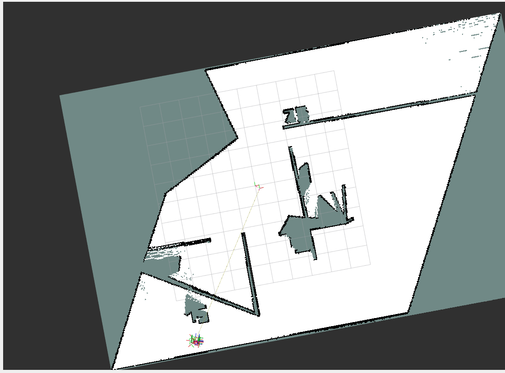 

Wszystkie dostępne przestrzenie zostały zamodelowane przez system.

W trakcie prac wizualizowano w rqt_graph działanie węzłów związanych ze SLAM. Tak się prezentują:

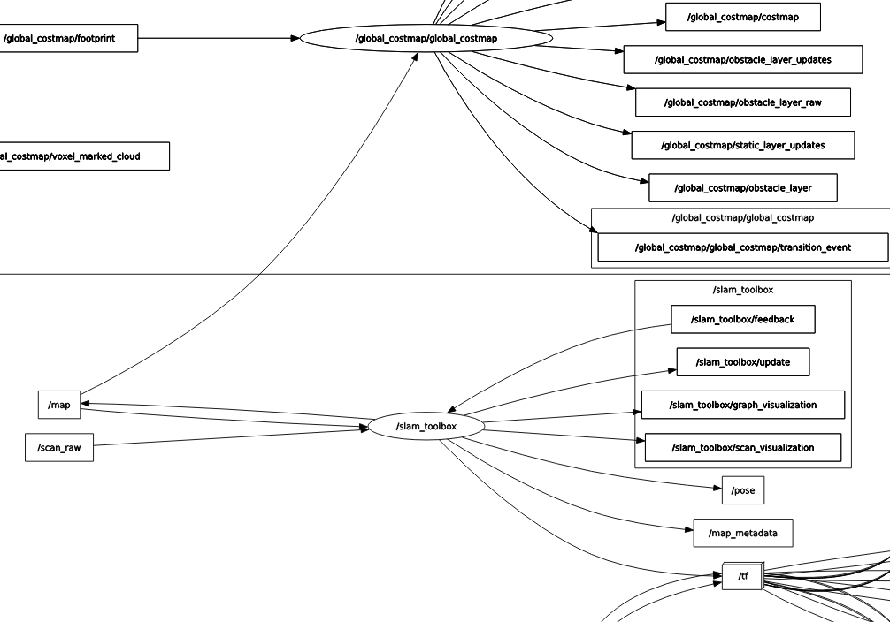 

Pokazuje on, że budowa mapy polega na sprzężeniu zwrotnym z tematem mapy i odczytywaniem wartości z symulowanego czujnika LIDAR, czyli tematu **\scan_raw**.


## Wczytywanie nowej mapy

Pakiet **opener** powiększono o kolejny plik launch - **map.launch.py**. Oparto go o plik **tiago_nav_bringup.launch**. Rezultatem nowego pliku launch było prawidłowe wczytywanie mapy w RVIZie:

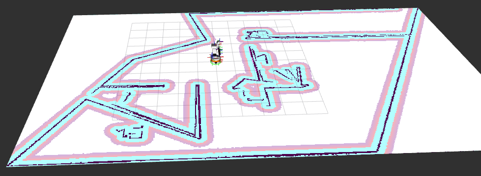

Problemem okazało się wczytywanie mapy kosztów, aby dobrze się ona kompilowała, należało w pliku **map.launch.py** opóźnić włączanie RVIZowych aplikacji:

```python
    actions.append(TimerAction(period=5.0, actions=[nav_bringup_launch]))
    actions.append(TimerAction(period=5.0, actions=[slam_bringup_launch]))
    actions.append(TimerAction(period=5.0, actions=[loc_bringup_launch]))
    actions.append(TimerAction(period=5.0, actions=[rviz_bringup_launch]))
    return actions

```

## Badanie programu symulacji robota.

Ostatnim elementem było stworzenie węzła odpowiadającego za nadawanie robotowi pozycji do poszczególnych miejsc w mieszkaniu. Oparto go o serwer akcji **navigate_to_pose**. Węzeł nazwano **point_commander**. Opera się on na pliku launch, aby można było nadawać miejsce docelowe w terminalu. Tak wygląda przykładowa komenda odpalająca program:

ros2 launch point_commander commander.launch.py place:='Wardrobe'

Tak prezentuje się część węzła odpowiedzialna za nadawanie pozycji:

```python

    goal_msg = NavigateToPose.Goal()
    goal_msg.pose.header.frame_id = 'map'
    goal_msg.pose.header.stamp = self.get_clock().now().to_msg()


    if self.place == "Kitchen":

        goal_msg.pose.pose.position.x = -3.65
        goal_msg.pose.pose.position.y = -0.844
        goal_msg.pose.pose.position.z = 0.0
        
        goal_msg.pose.pose.orientation = self.euler_to_quaternion(0.0, 0.0, -0.26)

    elif self.place == "WC":

        goal_msg.pose.pose.position.x = -2.56
        goal_msg.pose.pose.position.y = -3.8
        goal_msg.pose.pose.position.z = 0.0
        
        goal_msg.pose.pose.orientation = self.euler_to_quaternion(0.0, 0.0, 1.42)

    elif self.place == "Wardrobe":

        goal_msg.pose.pose.position.x = 2.35
        goal_msg.pose.pose.position.y = 4.8
        goal_msg.pose.pose.position.z = 0.0
        
        goal_msg.pose.pose.orientation = self.euler_to_quaternion(0.0, 0.0, -1.595)

    elif self.place == "Bedroom":

        goal_msg.pose.pose.position.x = 4.13
        goal_msg.pose.pose.position.y = 0.52
        goal_msg.pose.pose.position.z = 0.0
        
        goal_msg.pose.pose.orientation = self.euler_to_quaternion(0.0, 0.0, -1.67)

    elif self.place == "Sofa":

        goal_msg.pose.pose.position.x = -3.48
        goal_msg.pose.pose.position.y = -7.23
        goal_msg.pose.pose.position.z = 0.0
        
        goal_msg.pose.pose.orientation = self.euler_to_quaternion(0.0, 0.0, 0.25)

    self._action_client.send_goal_async(goal_msg).add_done_callback(self.goal_response_callback)
```

W zależności od wybranego pomieszczenia wysyłana jest inna pozycja.

Przetestowano działanie systemu poprzez wysłanie robota do kolejnych pomieszczeń:

Toaleta:
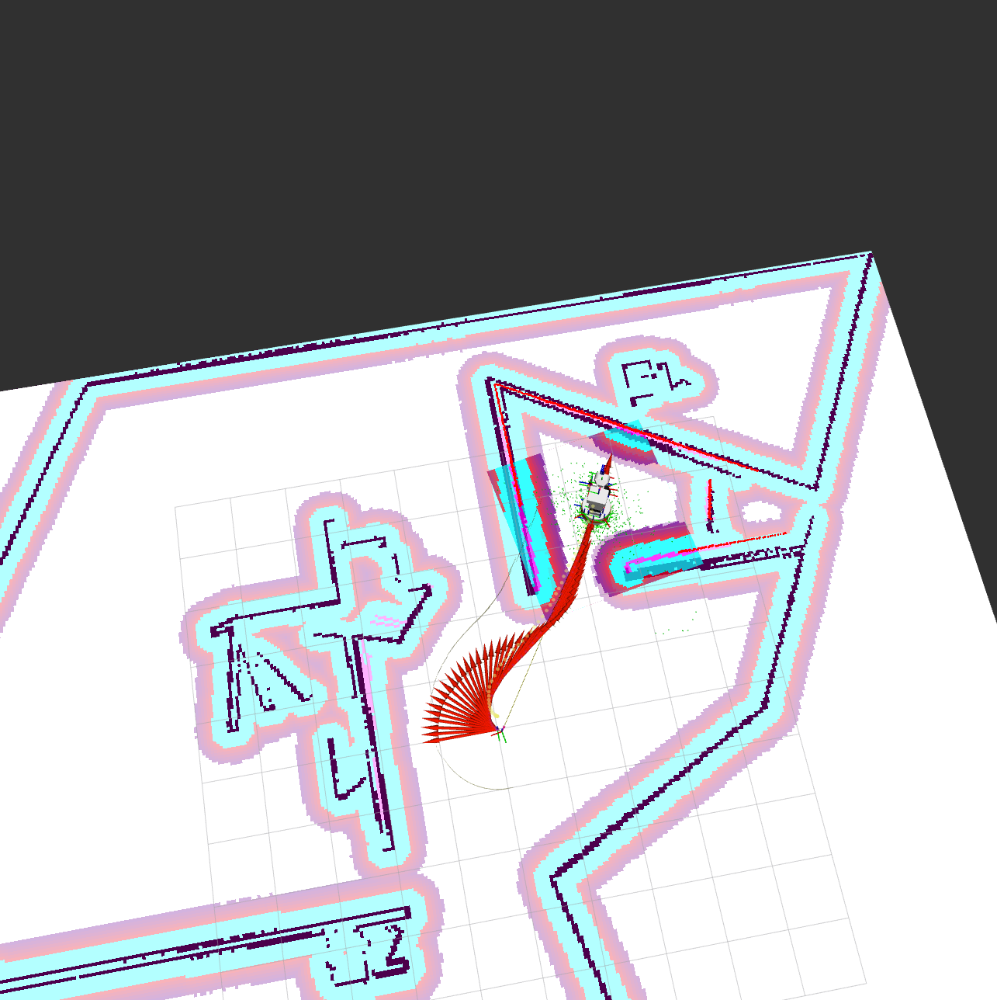

Kuchnia:
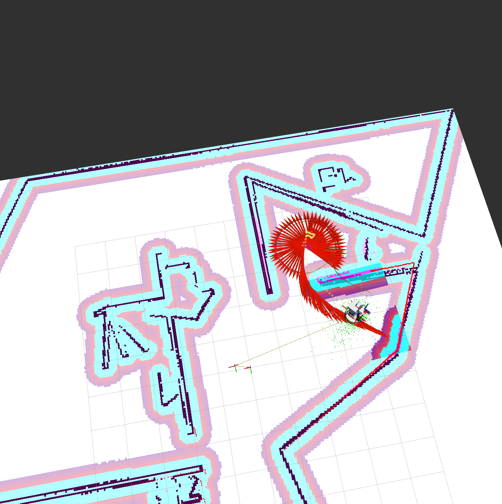

Sypialnia:
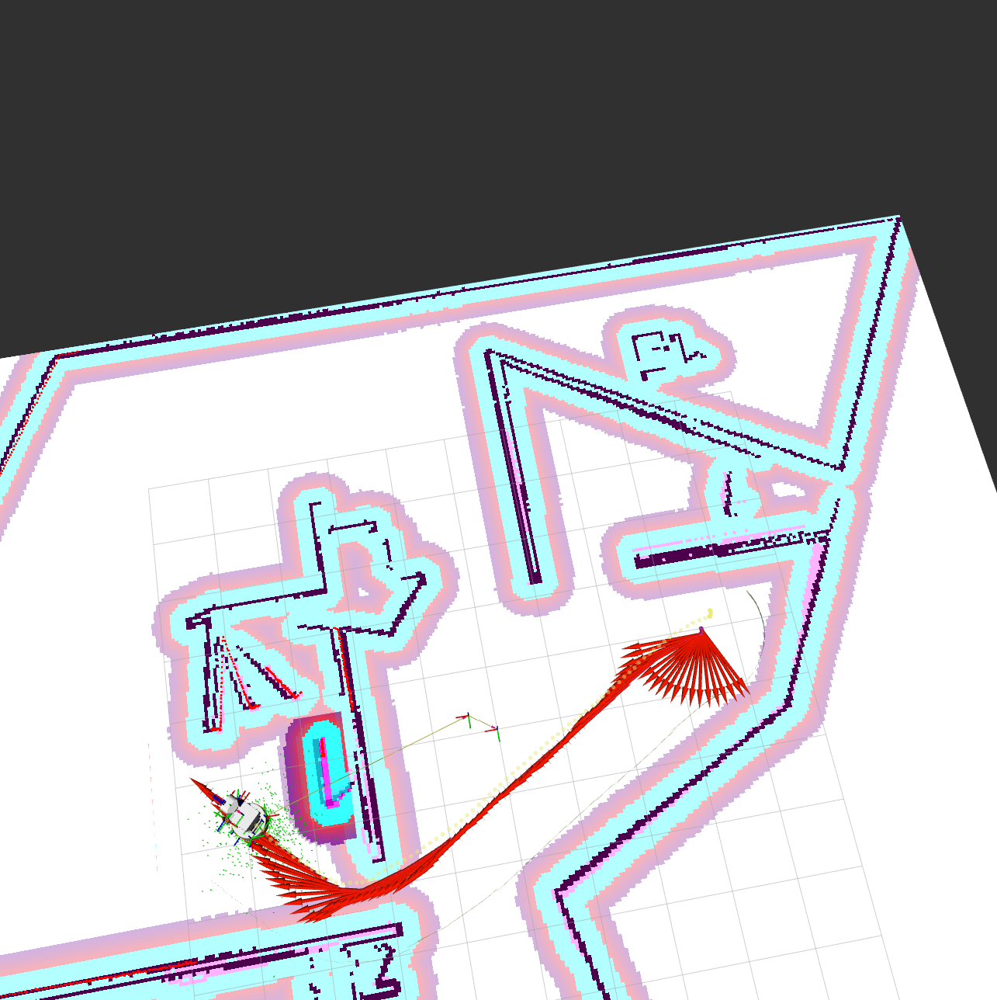

Szafa:
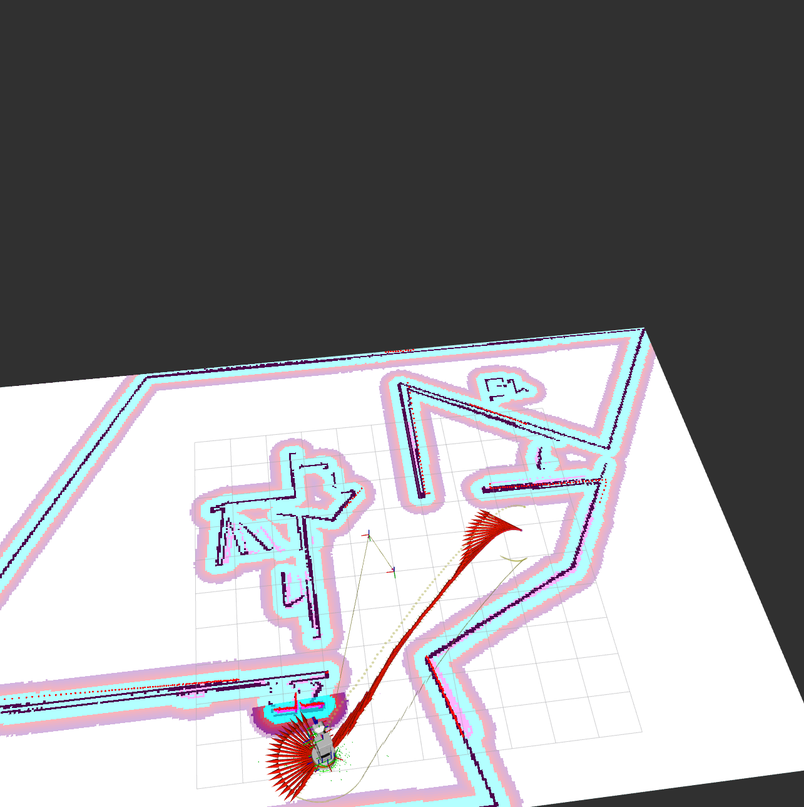

Niestety, przy ostrzejszych zakrętach robot miał trudności z ich wykonywaniem. Z tego powodu pozmieniano niektóre parametry w mapie globalnej i lokalnej za pomocą narzędzia **rqt_reconfigure**. Zmieniono:

Local Map:

- inflation_radius -> zwiększenie do 0.62
- cost_scaling_factor -> zwiększenie do 10.0

Global Map:

- inflation_radius -> zwiększenie do 0.6
- obsticle_max_range -> zmniejszenie do 1.0
- raytrace_max_range -> zmniejszenie do 2.0

Dzięki tym zmianom robotowi udało się wykonać ostry zakręto do fotela:

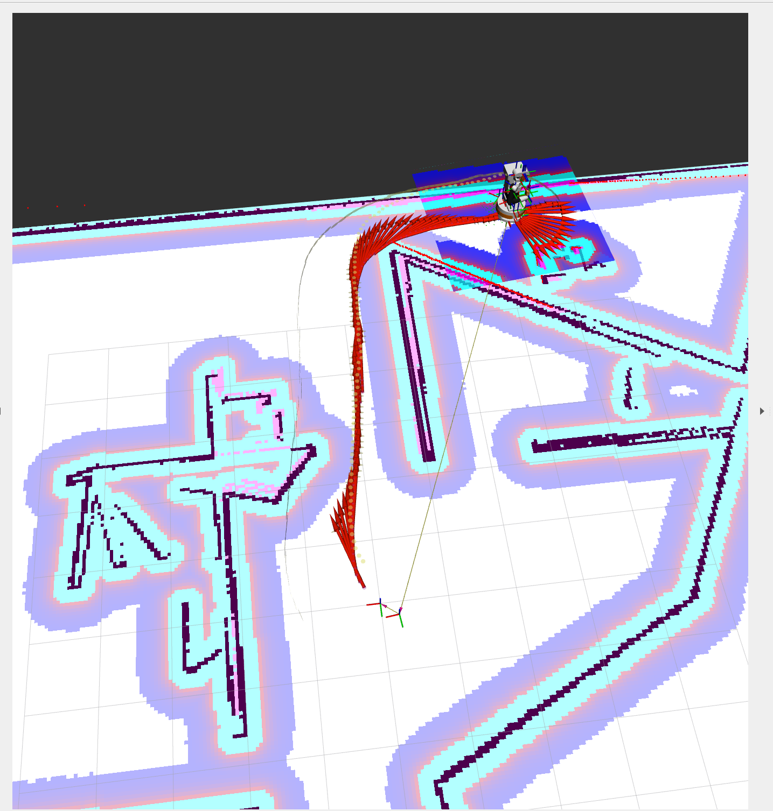

Niestety nie udało się wykonać jeszcze ostrzejszych zakrętów.

Przetestowano również pracę systemu przy rozstawionych w dużym pomieszczeniu przeszkodach-pudełkach. Robot poradził sobie dobrze, zmieniał swoją trajektorię w celu unikania pudełek i dojechał na drugą stronę pomieszczenia. Poniżej przedstawiono zrzuty ekranu z trasy w Gazebo i RVIZie:

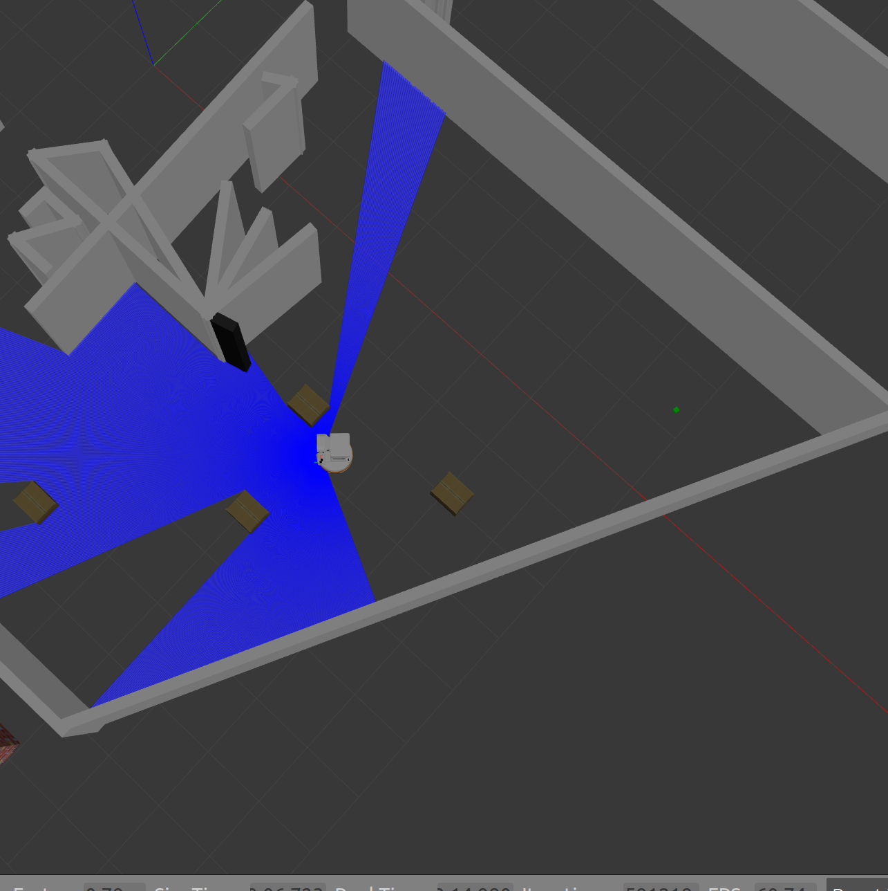

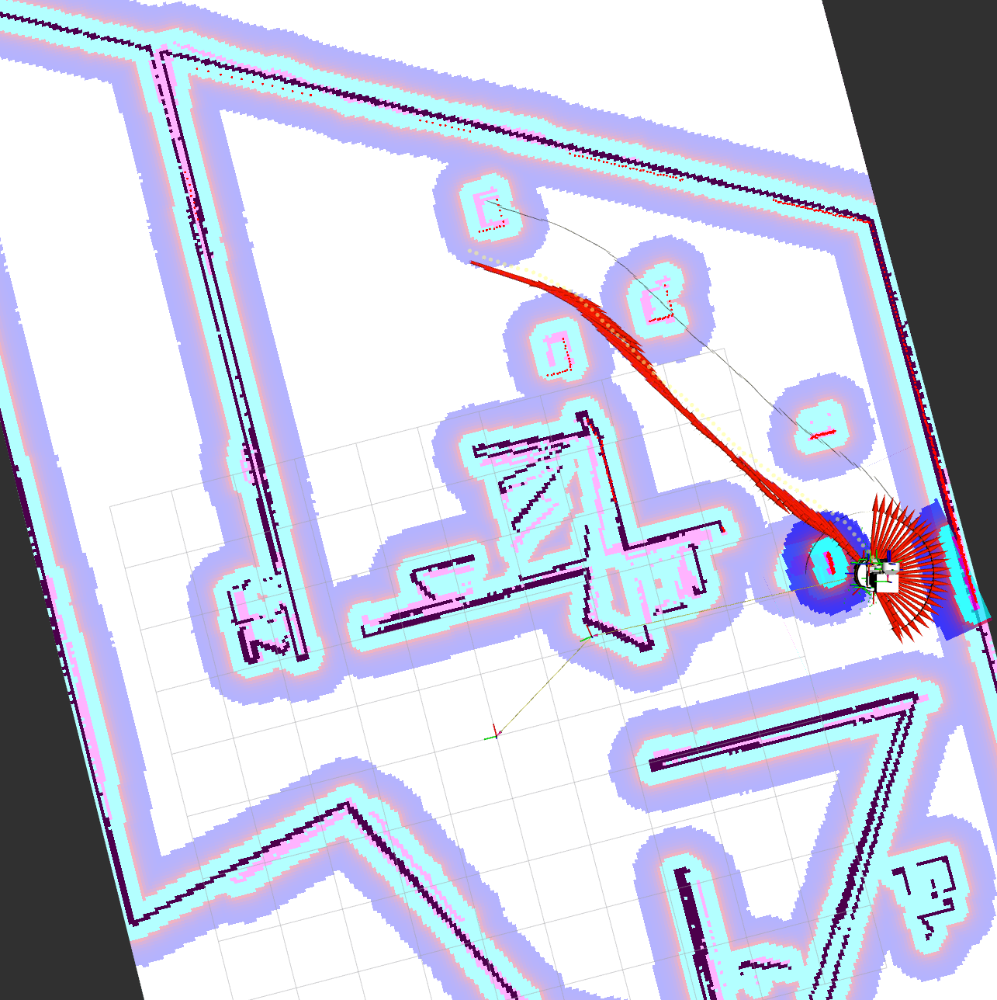