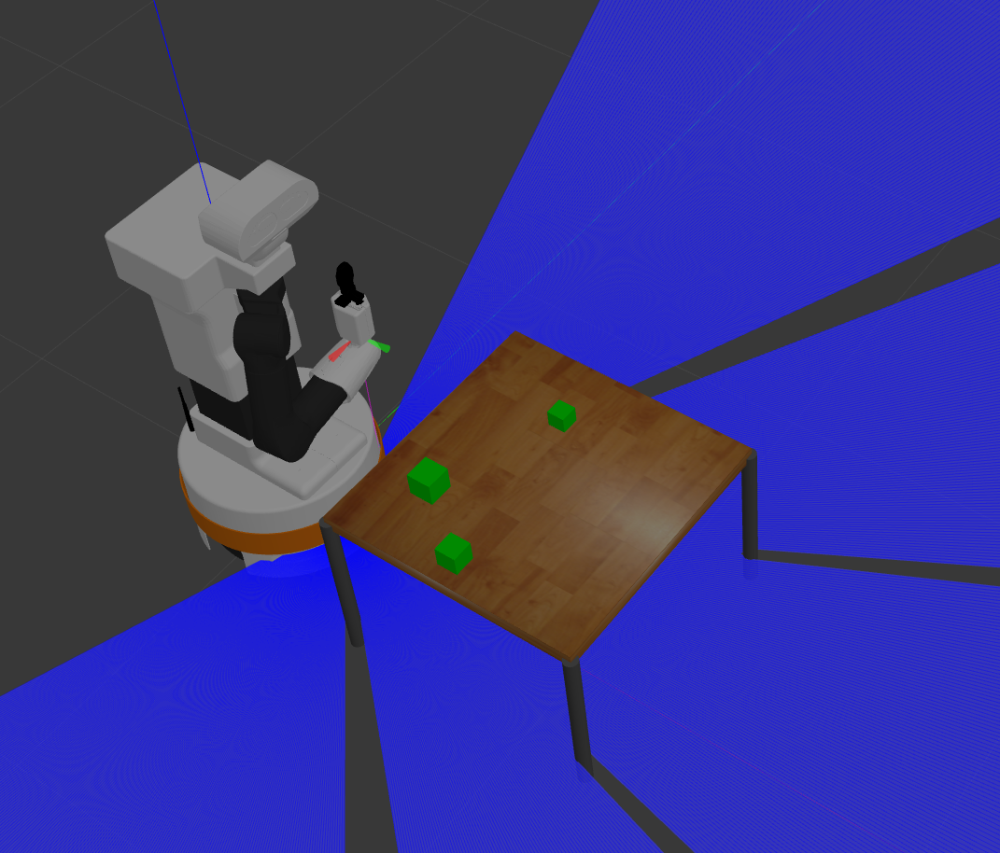
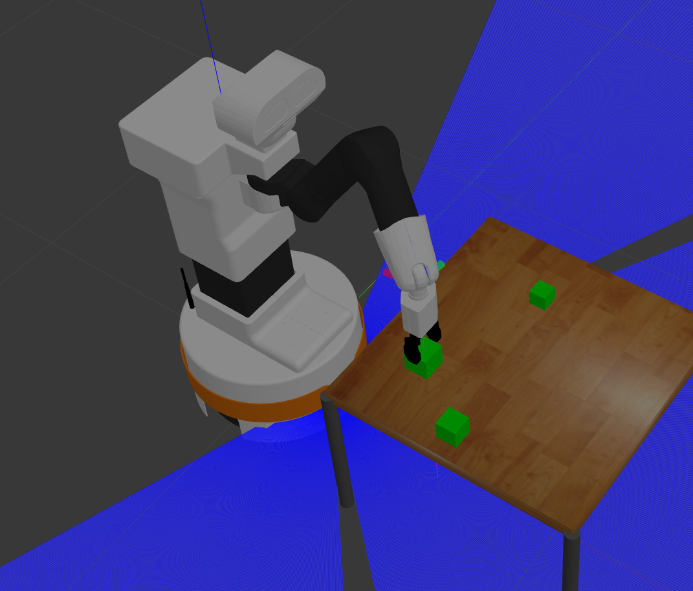
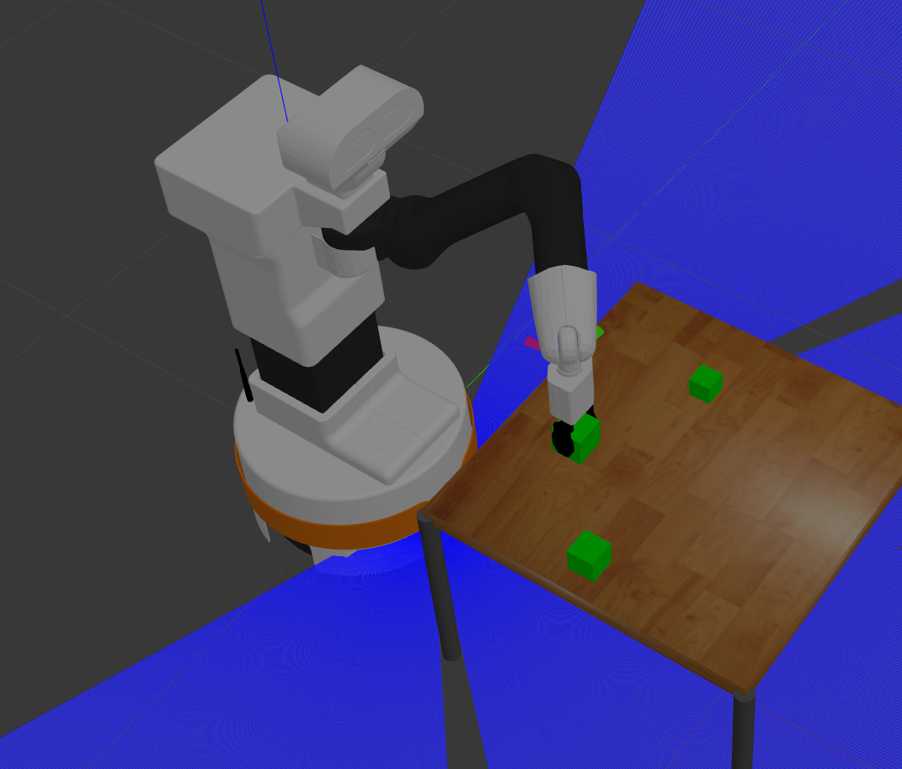
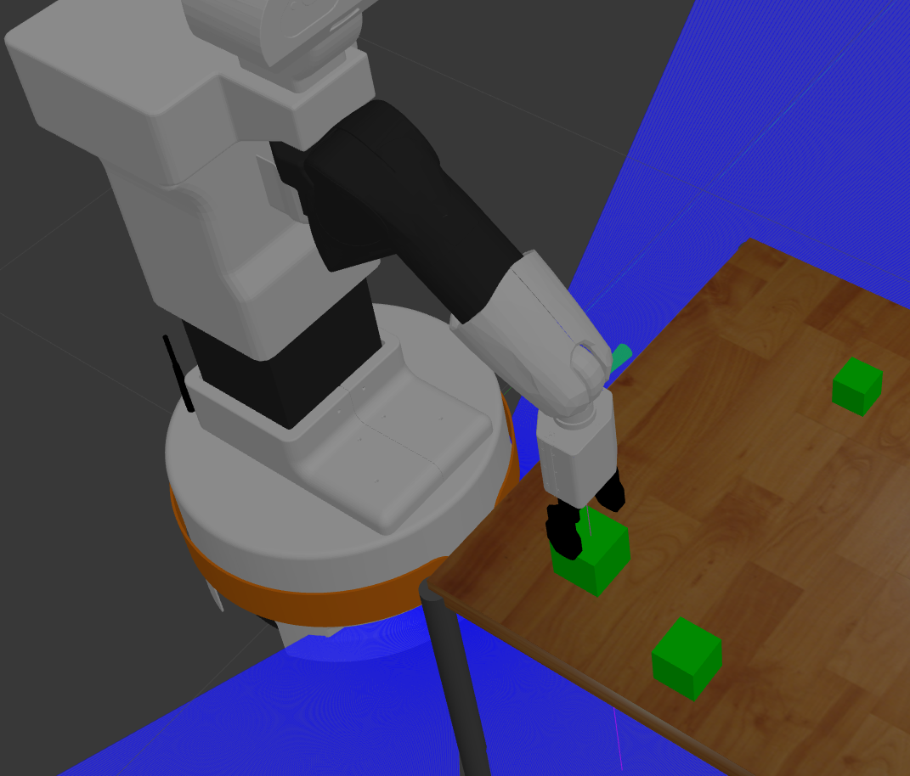
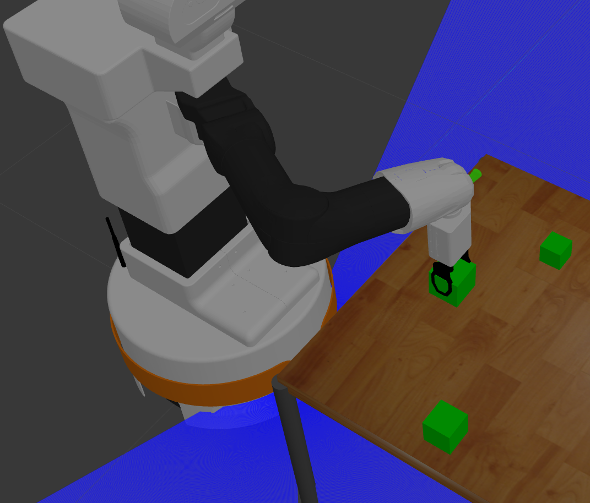
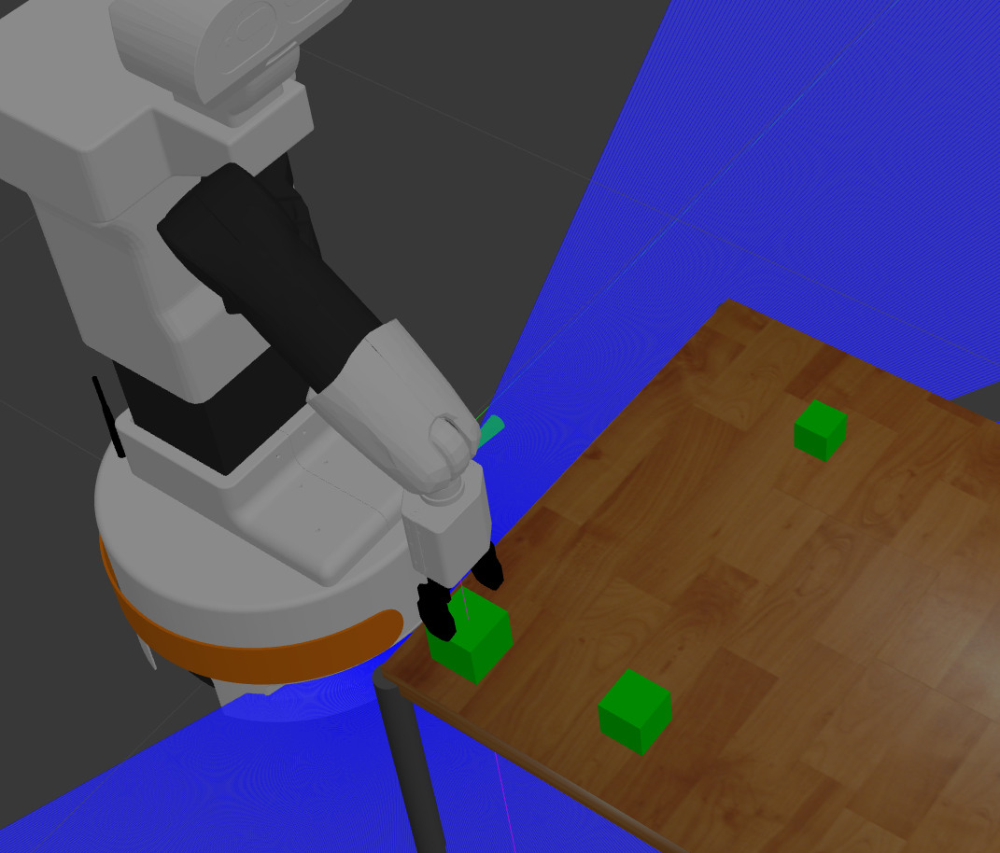
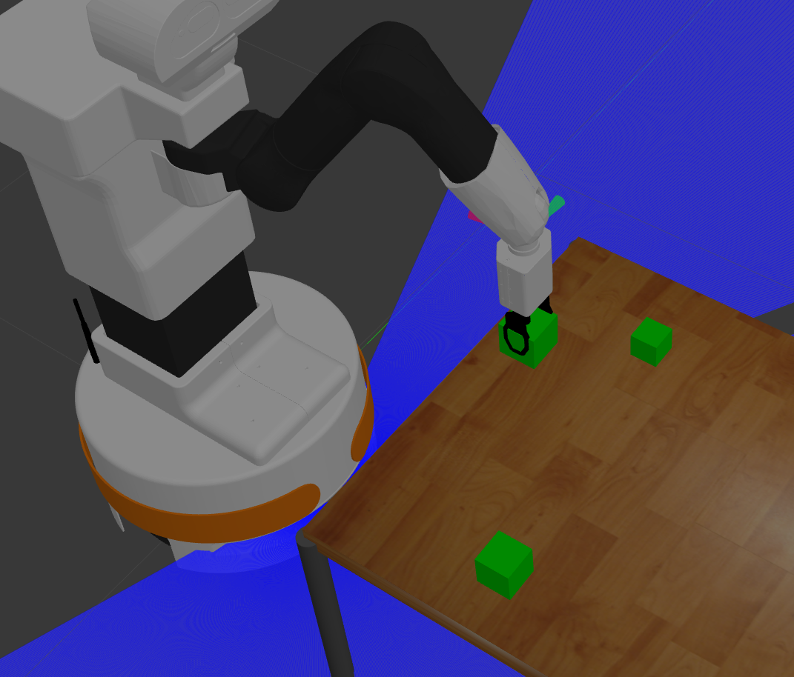
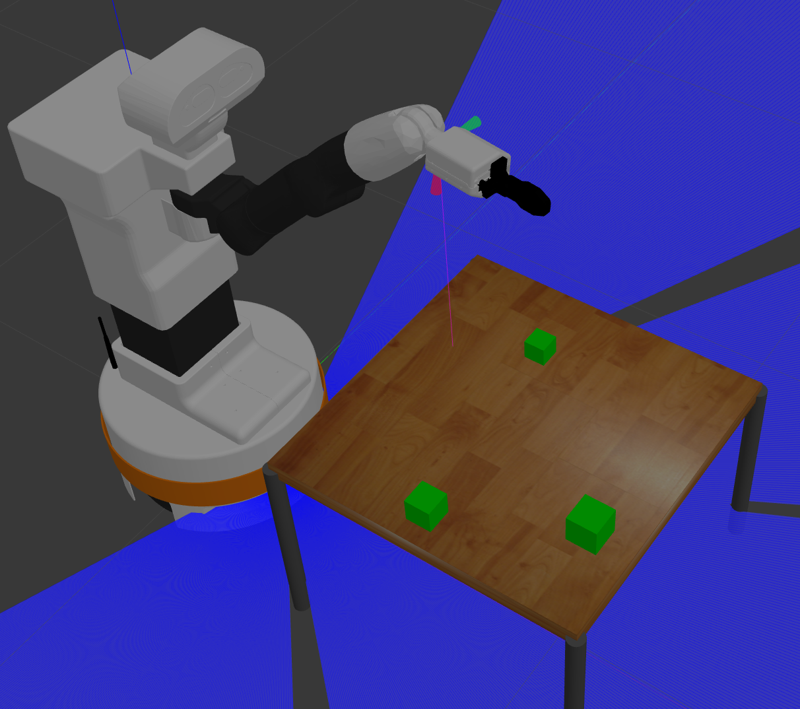
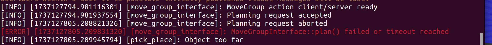

# 1.

Pierwsze polecenie polega jedynie na włączeniu środowiska - udało się.

Tak wygląda środowisko:

Odpalane jest komendą:

**ros2 launch hello_moveit system_bringup.launch.py is_public_sim:=True world_name:=stero navigation:=True moveit:=True  use_grasp_fix_plugin:=True**

# 2.

Na podstawie węzła one_grasp wykonano węzeł pick_place, który podnosi kostkę i odstawia ją w pozycji z przeciwną zmienną Y:

# 3.

Przetestowano działanie węzła dla dwóch innych prawidłowych pozycji i jednej nieprawidłowej.

Prawidłowe:

1.

2.

Nieprawidłowa:

Jeśli robot nie znajdzie chwytu to informuje o tym terminal.

# 4 i 5

Zapomocą przekształceń poznanych na wykładach przedmiotów robotycznych i bibliotek Eigen w C++ wykonano 12 różnych chwytów do kostki od górnej ścianki (pod kątem 90 stopni, 30 i -30 stopni). Kod przekształceń znajduje się w węźle **show_side_grasps**. Poniżej zostaną zamieszczone wszystkie z nich. Aby przejść do kolejnego chwytu należy kliknąć w Rviz guzik Next:

# 6 i 7

Na podstawie chwytów z poprzednich zadań wyznaczono pozostałe chwyty dla czterech bocznych ściań. Odpowiada za to węzeł **show_all_grasps**. Poniżej przedstawiono po jednym chwycie dla każdej ścianki:

# 8

W węźle **show_selected_grasps** zostaną uwzględnione jedynie te chwyty z **show_all_grasps**, jeśli z-towa zmienna chytu pre-grasp jest większa od z-towej zmiennej chwytu grasp.

# 9

Węzeł **pick_place_robust** wykonuje to samo zadanie co **pick_place**, jednak tym razem jeśli robot nie będzie mógł chwycić kostki bazowym chwytem, to spróbuje ją chwycić kolejnymi z węzła **show_selected_grasps**. Na przykłąd w poniższym przypadku robot chwyci kostkę pod kątem:

# 10

W tym zadaniu skupiono się na zadaniu ułożenia wieży z dwóch klocków. Kod jest w węźle **tower_2**. Chwytanie bazuje wciąż na węźle **pick_place_robust**. Poniżej zaprezentowano jak radzi sobie robot:

# 11 

W ostatnim zadaniu wykonano węzeł **tower_3**. Tym razem zostanie ułożona wieża z trzech kostek:

Niestety pomimo prób nie udało się tak dostosować chwytu, aby ros wykonał przyłączenie najmniejszej kostki do chwytaka, niemniej jednak jak widac na zdjęciach, gdyby nie to, to robot ułożył by bardzo ładną wieżę.