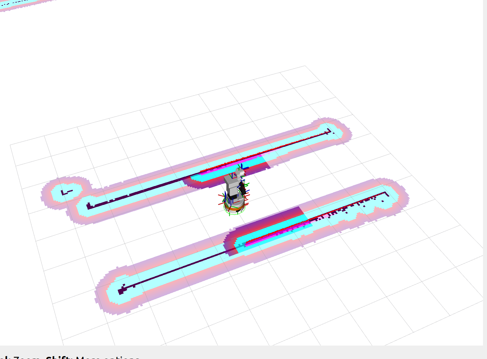
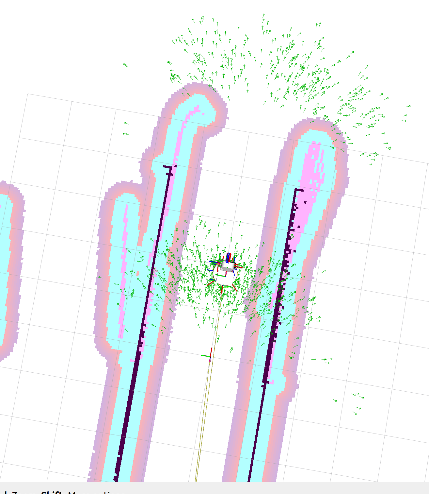
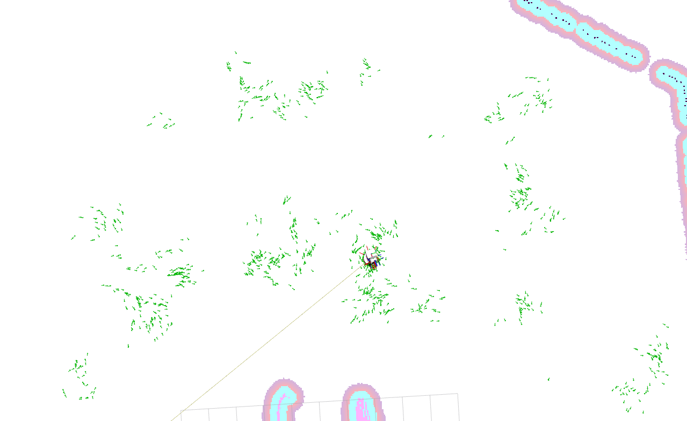
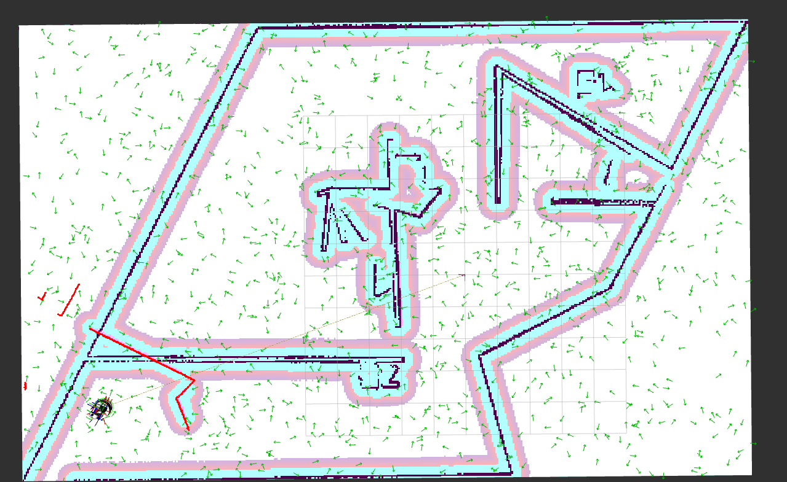
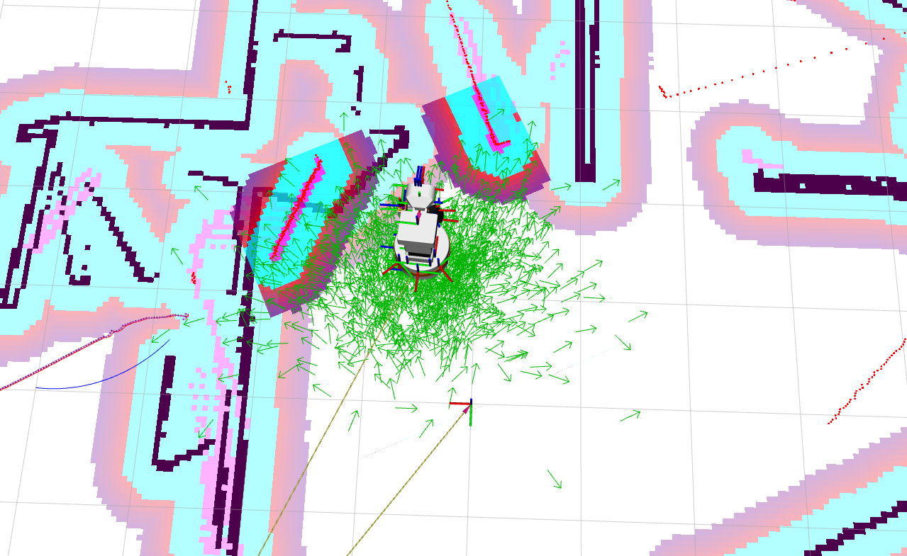
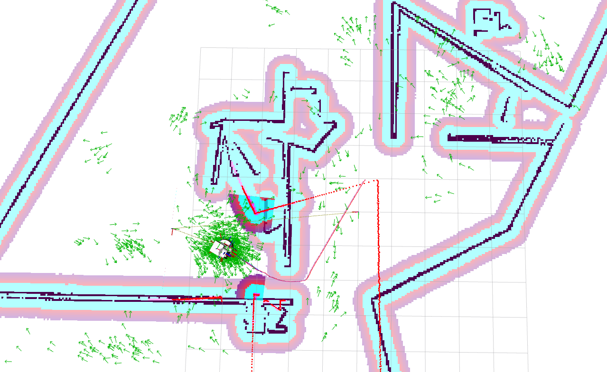
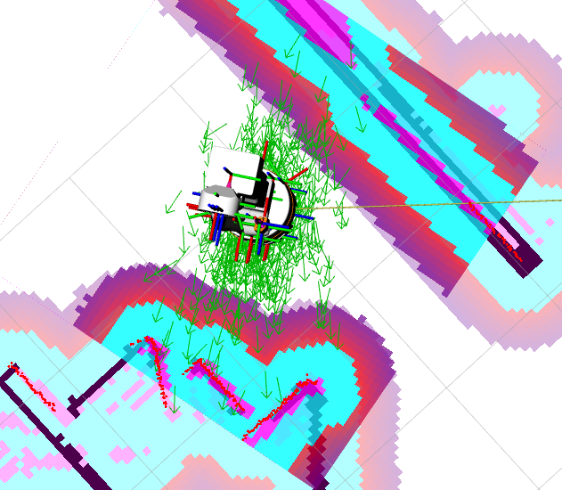
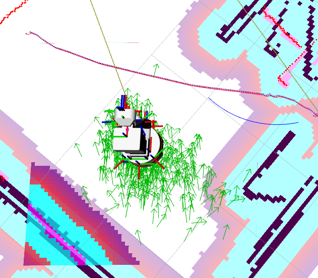

## Badanie lokalizacji globalnej w świecie ’korytarz’
Poprzez uruchomienie węzła teleop_twist_keyboard w nowym terminalu, stworzono przez poruszanie się robotem mapę środowiska *SLAM* naszego świata z korytarzem. Otrzymana mapa w rvizie widoczna jest na poniższym zdjęciu.

Następnie aktywowano badanie lokalizacji globalnej AMCL, które pozwala z pewnym prawdopodobieństwem określić położenie robota. Osiągnięty efekt dla mapy z korytarzem widać poniżej.

Gdy wyjechaliśmy robotem poza korytarz lokalizacja była dużo mniej dokładna co widać na poniższym zdjęciu.

Wynika to z tego, że robot nie ma żadnych ścian i obiektów wokół siebie przez co dużo gorzej może przewidzieć w jakim miejscu się znajduje.

## Badanie parametrów AMCL w świecie ’mieszkanie’ za pomocą narzędzia ’rqt_reconfigure’.
Zgodnie z treścią zadania skorzystano z narzędzia rqt configure aby zmieniać paramtry AMCL w świecie "mieszkanie" stworzonym na poprzednich laboratoriach. Poniżej zamieszczono zdjęcia wyników dla różnych ustawień parametrów.

Najpierw dla porównania przedstawiony poniżej został screenshot z wyniku AMCL dla domyślnie ustawionych parametrów w mieszkaniu.

Poniższe zdjęcie przedstawia sytuację gdzie wszystkie parametry są równe 1.

Na poniższym zdjęciu wszystkie parametry były zostawione domyślnie lecz zmieniono parametr *alpha1* na 0.7.

Na poniższym zdjęciu z kolei wszystkie parametry były zostawione domyślnie lecz zmieniono parametr *alpha3* na 1.

Na koniec ustawiono parametr *alpha3* na 1, efekt jest następujący.

### Wnioski
Przy nie dobranych wartościach lokalizacja robota za pomocą AMCL była bardzo niedokładna. Zauważyliśmy, że wartości alpha1 oraz alpha2 zwiększały szum cząsteczek podczas obrotu robota. Z drugiej strony alpha3 oraz alpha4 zwiększając powodowały większą niepewność pozycji robota podczas ruchu liniowego. Alpha3 różniła się tym od alpha4 że bardziej zwiększała losowość pozycji a alpha4 losowość orientacji podczas ruchu. Przy wartościach wszystkich równych 1 lokalizacja wokół robota była najbardziej losowa w orientacji i pozycji.