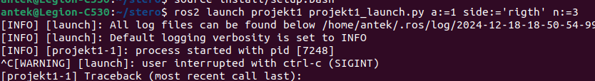
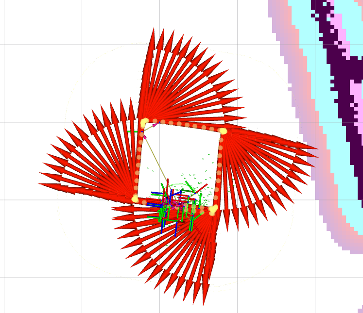
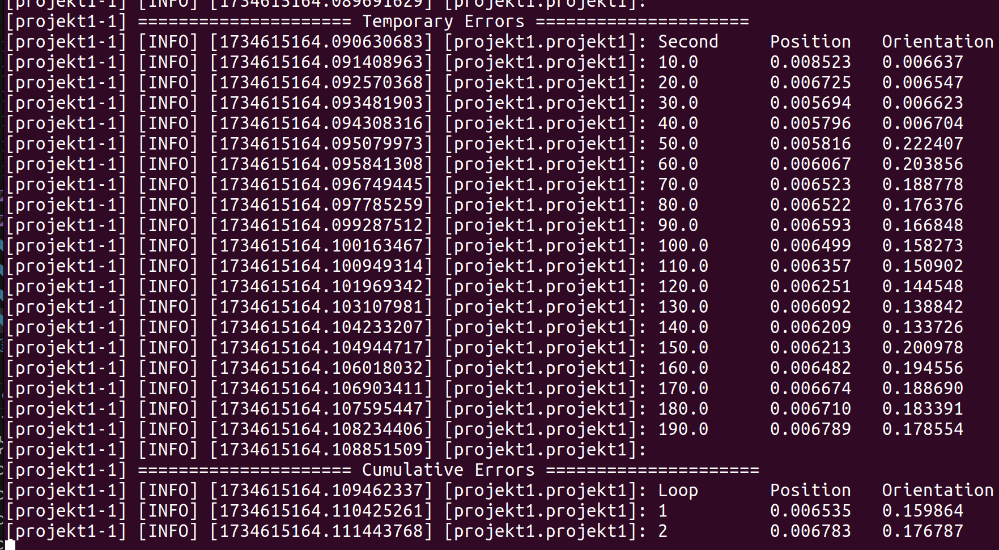
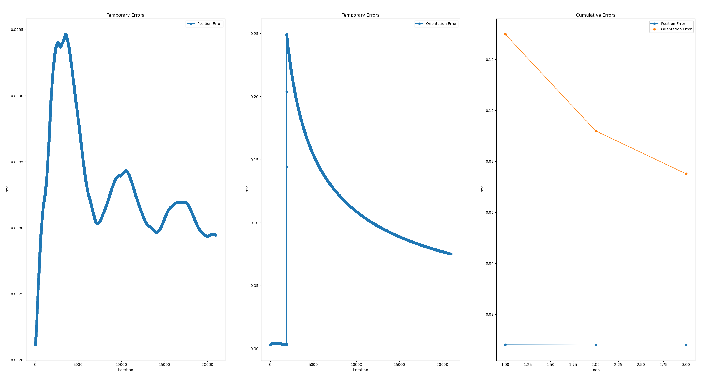
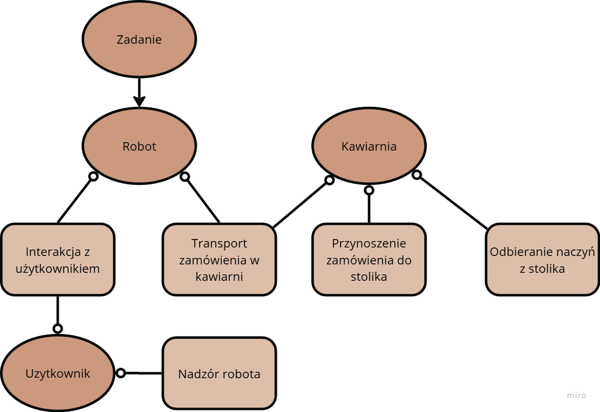
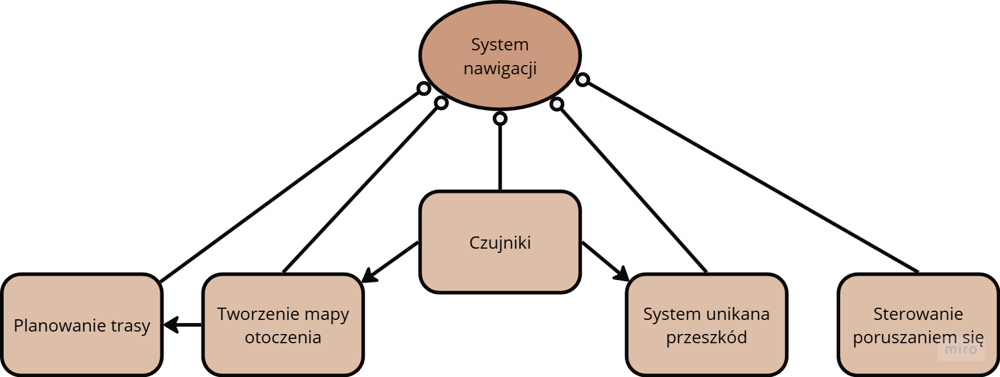
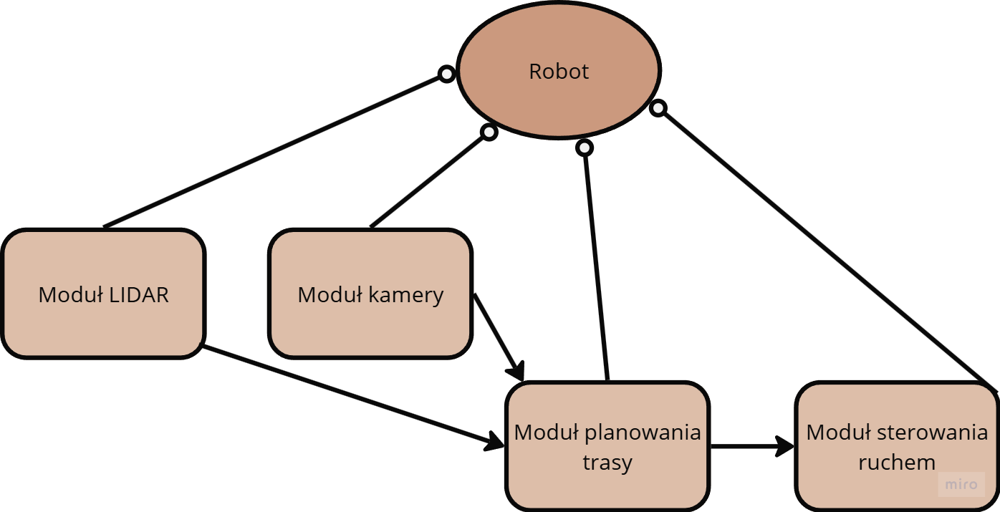

# System poruszania się robota po kwadracie z obserwowaniem błędu pozycji

## Dobór tematów  

Rozpoczęcie tworzenia węzła w języku Python polegało na dobraniu subskrybowanych tematów do czytania pozycji robota:

- Temat **`/ground_truth_odom`** do odczytywania pozycji z symulowanego sensora odometrii.  
- Temat **`/mobile_base_controller/odom`** do odczytywania odometrii bazy robota w systemie.

Wykorzystywany będzie również temat:

- **`/cmd_vel_nav`** do zadawania prędkości liniowej i obrotowej.

## Sterowanie robotem

W przeciwieństwie do zadawania czasu ruchu i obrotu jak na laboratoriach nr 1, zdecydowaliśmy się na inny sposób zadawania ruchu i obrotu. 

Robot będzie wprawiany w ruch liniowy lub obrotowy, a w między czasie liczony będzie dystans pokonany przez robota, albo obrót wykonany przez robota. Gdy osięgnięta zostanie odpowiednia długość boku lub obrót o 90 stopnii, robot jest zatrzymywany.

Poniżej znajdują się kod funkcji odpowiedzialny na ruch:

```python
for loop_index in range(self.n):

    for side in range(4):
        self.theta_perspective = self.fixed_degree
        angular_distance = abs(self.fixed_degree- self.theta_perspective)
        er = pi/2 - angular_distance
        while er > 0.011:
            rclpy.spin_once(self, timeout_sec=0.1)
            if self.side == "left":
               self.send_velocity(0.0, 0.3)
            elif self.side == "rigth":
                self.send_velocity(0.0, -0.3)
                angular_distance = abs(self.fixed_degree - self.theta_perspective)
                er = pi/2 - angular_distance

            self.i = 0
            self.stop()

            self.x_perspective = self.current_position['x']
            self.y_perspective = self.current_position['y']

            dx = self.current_position['x'] - self.x_perspective
            dy = self.current_position['y'] - self.y_perspective

            distance = sqrt(dx**2 + dy**2)
            err = self.a - distance

            while err > 0.1:

                rclpy.spin_once(self, timeout_sec=0.1)
                self.send_velocity(0.2, 0.0)

                dx = self.current_position['x'] - self.x_perspective
                dy = self.current_position['y'] - self.y_perspective

                distance = sqrt(dx**2 + dy**2)

                err = self.a - distance

            self.stop()
```

---

## Normalizacja kąta

W czasie tworzenia węzła należy się uporać z problemem odczytywania z tematu odometrii kąta z przedziału od -pi do pi. Powoduje to błędy przy mierzeniu wykonanego kąta przy przekraczaniu granicy. Uporano się z tym poprzez normalizację odczytywanego kąta:

```python

    def odom_callback(self, msg):
        """Callback from /mobile_base_controller/odom."""
        self.current_position['x'] = msg.pose.pose.position.x
        self.current_position['y'] = msg.pose.pose.position.y
        self.current_position['theta'] = self.quaternion_to_yaw(msg.pose.pose.orientation)

        if self.quaternion_to_yaw(msg.pose.pose.orientation) < 0.0:

            self.i = 1

        if self.i == 1:
            if self.quaternion_to_yaw(msg.pose.pose.orientation) > 0.0:
                self.fixed_degree = 2*pi + abs(self.quaternion_to_yaw(msg.pose.pose.orientation))                            
            else:
                self.fixed_degree = 2*pi - abs(self.quaternion_to_yaw(msg.pose.pose.orientation))
        else:
            self.fixed_degree = self.quaternion_to_yaw(msg.pose.pose.orientation)

```

---

## Parametry systemu

System wczytuje 3 parametry:

1. **`a`** - długość boku kwadratu.  
2. **`side`** - wybór w którą stronę będzie jechał robot.
3. **`n`** - ilość powtórzeń okrążeń.

Parametry są wczytywane wraz z wywołąniem węzła w terminalu. Tak prezentuje się przykładowe wywołanie systemu:


## Działanie ruchu

Poniżej zamieszczono rezultat zadanego ruchu robota w wizualizacji z programu Rviz:


## Obserwowanie błędu odometrii
Po zakończeniu wykonywania zadanej przez nas ilości okrążeń, nasz kod generuje raport w postaci tablicy z obliczonymi błędami w terminalu. Błędy średniokwadratowe liczone są między wartościami odometrii zmierrzonymi pomiędzy dwoma węzłami, '/mobile_base_controller/odom' i '/ground_truth_odom'. Funkcja calculate_errors została pokazana poniżej. Current_position to pozycja odebrana od odometrii z bazy robota, a ground_truth_position to z odebrana z węzła /ground_truth_odom.
```python
def calculate_errors(self):
        dx = self.current_position['x'] - self.ground_truth_position['x']
        dy = self.current_position['y'] - self.ground_truth_position['y']
        position_error_squared = (dx**2 + dy**2)
        orientation_error_squared = fabs(self.current_position['theta'] - self.ground_truth_position['theta'])**2

        self.position_squared_sum += position_error_squared
        self.orientation_squared_sum += orientation_error_squared
        self.num_samples += 1
```
Błąd chwilowy obliczany jest następująco.
```python
def check_temporary_errors(self):
    current_time = time.time() - self.start_time
    mean_position_error = sqrt(self.position_squared_sum / self.num_samples)
    mean_orientation_error = sqrt(self.orientation_squared_sum / self.num_samples)

    self.temporary_errors.append((int(current_time), mean_position_error, mean_orientation_error))
```
Następnie po wykonaniu każdej pętli liczony jest błąd kumulowany w poniższy sposób.
```python
    mean_position_error = sqrt(self.position_squared_sum / self.num_samples)
    mean_orientation_error = sqrt(self.orientation_squared_sum / self.num_samples)
    self.cumulative_errors.append((loop_index + 1, mean_position_error, mean_orientation_error))

    self.get_logger().info(
        f"Loop {loop_index + 1} Complete - Cumulative Errors: Position: {mean_position_error:.6f}, "
        f"Orientation: {mean_orientation_error:.6f}"
    )
```
Końcowo generowanie tablicy błędów jest zrobione w następujący sposób.
```python
def generate_report(self):
    self.get_logger().info("\n===================== Temporary Errors =====================")
    self.get_logger().info(f"{'Second':<10} {'Position':<10} {'Orientation':<10}")
    for t, pos, orient in self.temporary_errors:
        self.get_logger().info(f"{t:<10.1f} {pos:<10.6f} {orient:<10.6f}")

    self.get_logger().info("\n===================== Cumulative Errors =====================")
    self.get_logger().info(f"{'Loop':<10} {'Position':<10} {'Orientation':<10}")
    for loop, pos, orient in self.cumulative_errors:
        self.get_logger().info(f"{loop:<10} {pos:<10.6f} {orient:<10.6f}")
    
    times, temp_pos, temp_orient = zip(*self.temporary_errors)
    loops, cum_pos, cum_orient = zip(*self.cumulative_errors)   
```

Tablica wygenerowana dla ruchu przy zadanych dwóch pętlach pokazana jest poniżej.

Oprócz tego generowany jest na podstawie tych danych wykres.

Jak widać na osiągniętych wynikach błąd orientacji jest nieco wyższy od błędu pozycji. Zauważyć można momenty obrotu robota, w trakcie ruchu do przodu błąd orientacji jest stały i dużo niższy, z drugiej strony, kiedy zaczyna się on obracać, błąd ten znacząco rośnie.

Błąd skumulowany zwiększa się z każdą pętlą co wynika z tego że jest on sumą poprzednich błędów.

## Architektura systemu robota-kelnera
Stworzone zostały trzy diagramy dla trzech poziomów abstrakcji naszego systemu. Diagramy przedstawione zostały poniżej.



Pierwszy diagram przedstawia najwyższy spośród przedstawionych poziomów abstrakcji, gdzie przedstawione są ogólne procesy działań robota. Następny diagram przedstawia relację między systemem nawigacji robota a innymi systemami w robocie.
Ostatni diagram przedstawia konkretne moduły i czujniki robota, których używa do wyonywania swoich zadań.