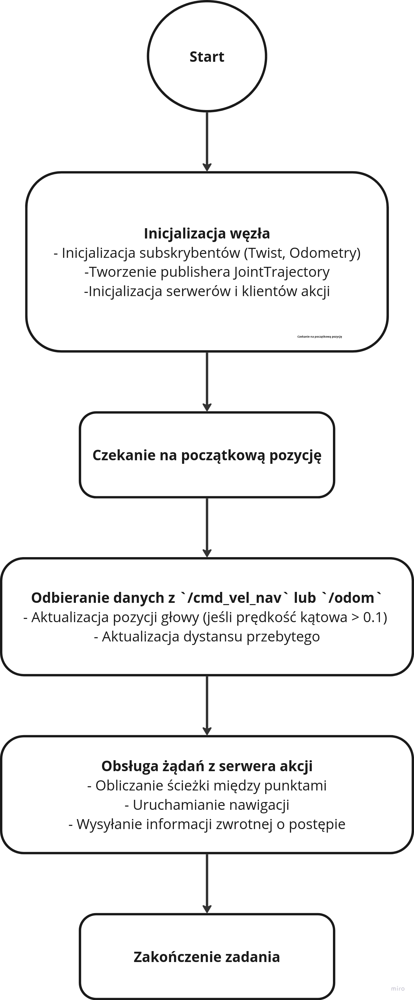
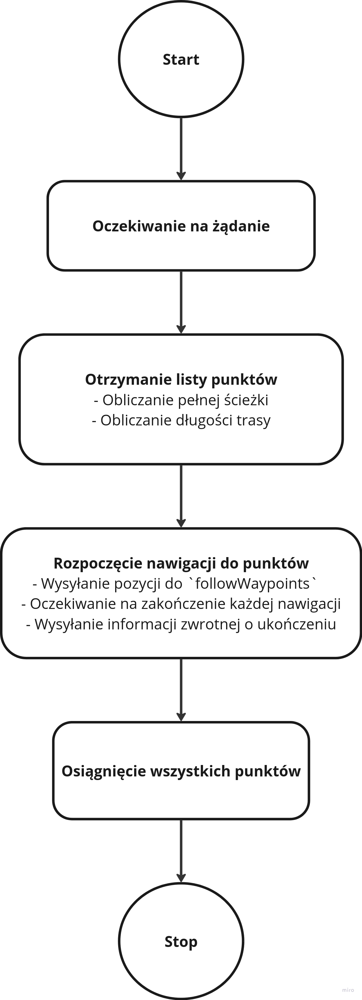
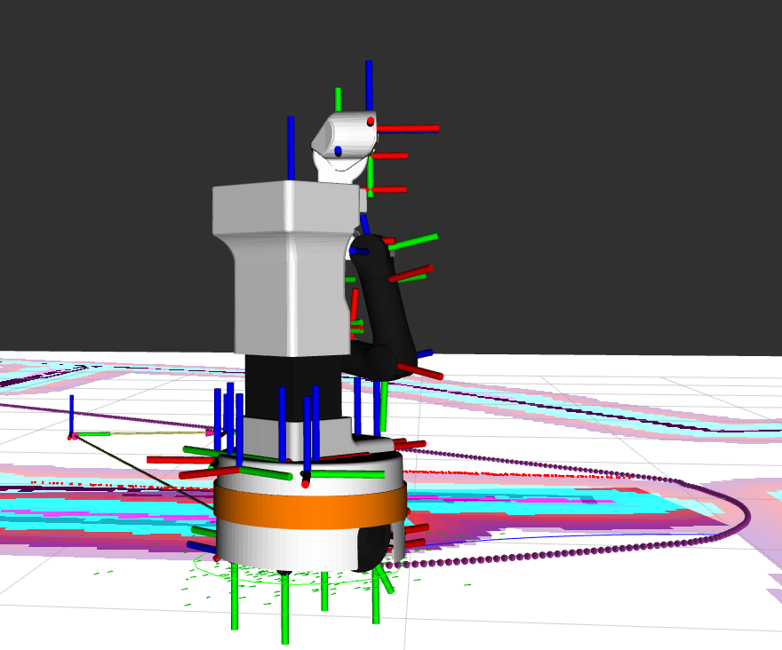

## Treść zadania: **Wykorzystując Simple Commander API1 napisać węzeł ROS2, który zrealizuje ruch przez listę zadanych punktów, a podczas ruchu obrotowego węzeł dodatkowo steruje głową robota obracając ją w kierunku zgodnym z ruchem obrotowym bazy mobilnej.**

Zgodnie z treścią zadania stworzono nowy węzeł o nazwie *projekt2* którego zadaniem jest poruszenie się po zadanych punktach z głową robota poruszającą się w odpowiednim kierunku.
Diagramy czynności opisujące działanie naszego węzła zamieszczono poniżej. Najpierw przedstawiony jest ogólny diagram działania naszego węzła.

Powyższy diagram pokazuje w jaki sposób działa nasz węzeł od inicjalizacji do zakończenia.
Następnie stworzony został kolejny diagram opisujący działanie akcji NavigatePoints odpowiedzialnej za przetwarzanie żądań i nawigacją robotem.

Poniżej zamieszczone zostało zdjęcie z działającego węzła.

Po pierwsze widoczny jest skręt głowy robota w kierunku ruchu. Róznież można zauważyć na powierzchni obliczoną trasę robota wyświetlaną przez serwer followWaypoints.

Poniżej opisywana jest budowa naszego kodu z większą dokładnością, opisując konkretne funkcje w kodzie.
Funkcja main wywołująca nasz węzeł wygląda następująco.
```python
def main(args=None):
    rclpy.init(args=args)

    node = projekt2()

    points = [
        (-3.65, -0.844, -0.26),
        (4.13, 0.52, -1.67),
        (-2.56, -3.8, 1.42),
        (2.35, 4.8, -1.595),
    ]

    try:
        time.sleep(3)
        node.send_server_goal(points)
        rclpy.spin(node)        
    except KeyboardInterrupt:
        node.get_logger().info('Node interrupted by user.')
    finally:
        node.destroy_node()
        rclpy.shutdown()
```
Punkty zadawane są do metody *send_server_goal*, gdzie każdy z punktów to krotka z trzema współrzędnymi x,y oraz z.
Nasz węzeł komunikuje się z kilkoma innymi węzłami, co zostało zaprezentowane w poniższym listingu z inicjalizacji naszego węzła.
```python
def __init__(self):
        super().__init__('projekt2')

        self.basic_navigator = BasicNavigator()

        self.head_publisher = self.create_publisher(JointTrajectory, '/head_controller/joint_trajectory', 10)
        self.velocity_subscriber = self.create_subscription(Twist, '/cmd_vel_nav', self.velocity_callback, 10)
        self.odom_subscriber = self.create_subscription(Odometry, '/mobile_base_controller/odom', self.odom_callback, 10)
        self.follow_waypoints_client = ActionClient(self, FollowWaypoints, 'follow_waypoints')
        self.action_server = ActionServer(self, NavigatePoints, 'navigate_points', self.server_callback)
        self.action_client = ActionClient(self, NavigatePoints, 'navigate_points')

        self.current_velocity = 0.0

        self.previous_pose = []
        self.current_pose = [] 


```
Po pierwsze węzeł publikuje informacje typu JointTrajectory na temat /head_controller/joint_trajectory w celu kontrolowania ruchu głową. Wykonywane to jest w metodzie *move_head* odpowiedzialnej za ruch głowy pokazanej poniżej.
``` python
def move_head(self, head_1_angle, time_from_start=1):

        trajectory_msg = JointTrajectory()
        trajectory_msg.joint_names = ['head_1_joint', 'head_2_joint']

        point = JointTrajectoryPoint()
        point.positions = [head_1_angle, 0.0]
        point.time_from_start.sec = int(time_from_start)

        trajectory_msg.points = [point]
        self.head_publisher.publish(trajectory_msg)

```
Jak widać w powyższym kodzie jedynie wpływamy na jeden ze stawów głowy robota, ponieważ nie ma potrzeby porusznia nią góra-dół.

Nasz węzeł subskrybuje na temacie cmd_vel_nav, który zwraca informacje o prędkości robota. W przypadku nowej wiadomości na tym temacie, to znaczy zmiany prędkości, wywoływana jest funkcja self.velocity_callback która jest pokazana poniżej.
```python
def velocity_callback(self, msg):

        self.current_velocity = msg.angular.z
        if abs(self.current_velocity) < 0.01:
            self.move_head(0.0)
        else:
            angle = self.current_velocity*math.pi/3
            self.move_head(angle)

```
Jak widać w powyższej funkcji. Nasz robot w przypadku minimalnej lub zerowej prędkości kątowej ustawia głowę na wprost. Jeżeli jednak jest jakaś prędkość kątowa to robot proporcjonalnie porusza głową w stronę skrętu.

Kolejnym tematem z którym komunikuje się nasz węzeł to temat */mobile_base_controller/odom* który zawiera dane o odometrii robota. Funkcja self.odom_callback jest wywoływana, gdy przyjdą nowe dane o odometrii. Funkcja ta oblicza przejechaną odległość naszego robota.

Następnie, nasz węzeł komunikuje się także z serwerem akcji *follow_waypoints*. Server ten obsługuje poruszanie się za zadanymi punktami.

Następnie stworzony został własny serwer akcji o nazwie *NavigatePoints* który jest odpowiedzialny za obliczanie postępu wykonania zadania. Callback z tego serwera pokazany jest poniżej.
```python
def server_callback(self, goal_handle):

        self.wait_for_initial_pose()

        self.get_logger().info('Nawiązano połączenie!')

        rclpy.spin_once(self, timeout_sec=0.1)

        feedback = NavigatePoints.Feedback()
        points = goal_handle.request.waypoints
        path_points = Path()
        begin_p = self.make_pose_stamped(self.current_pose[0], self.current_pose[1], 0.0)
        path_points = self.basic_navigator.getPathThroughPoses(begin_p, points)
        full_distance = self.calculate_path_length(path_points.poses)

        self.followWaypoints(points)

        while not self.isNavComplete():
            rclpy.spin_once(self, timeout_sec=0.1)
            feedback.progress = self.distance_made/full_distance*100
            goal_handle.publish_feedback(feedback)
         
        goal_handle.succeed()
        self.get_logger().info("Zakończono") 
        result = NavigatePoints.Result()
        result.success = True

        return NavigatePoints.Result(success=True)
```
Powyższy callback wywołuje funkcję self.followWaypoints(points) która za pomocą serwera *followWaypoints* porusza robotem przez wskazane punkty.
Poniżej zamieszczony został kod funkcji *send_server_goal* wywoływanej w funkcji main programu.
```python
def send_server_goal(self, points):

        goal_msg = NavigatePoints.Goal()

        prepared_points = []

        for point in points:

            prepared_points.append(self.make_pose_stamped(point[0], point[1], point[2]))      

        goal_msg.waypoints = prepared_points

        self._send_goal_future = self.action_client.send_goal_async(goal_msg, feedback_callback=self.feedback_callback)
        self._send_goal_future.add_done_callback(self.goal_response_callback)
```
Oprócz zczytywania współrzędnych każdego z punktów, funkcja ta tworzy klientów dwóch akcji odpowiedzialnych za sprawdzanie poprawności wysłanych żądań, oraz drugiego który wypisuje aktualny postęp wykonania zadania obliczony w poprzedniej części kodu.

